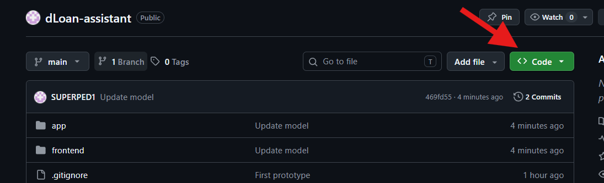
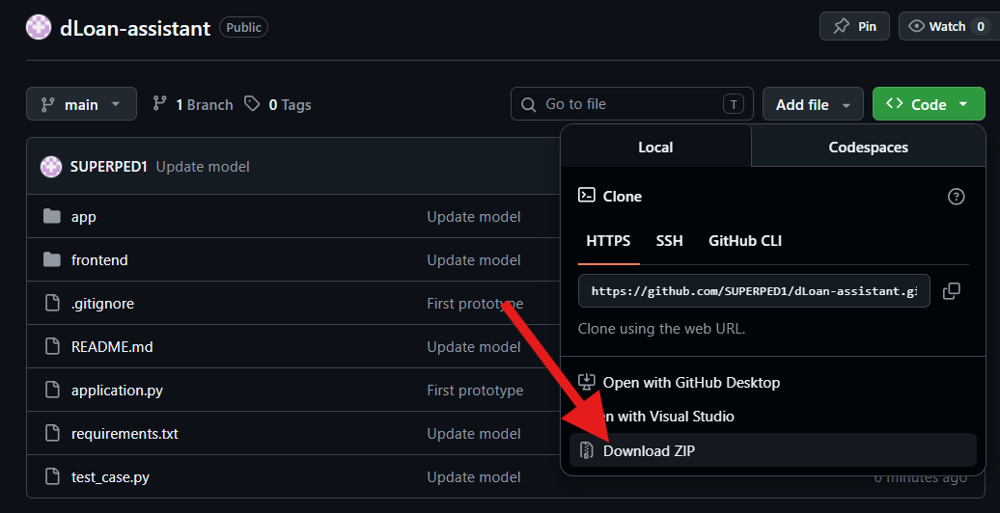
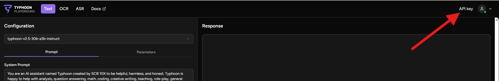
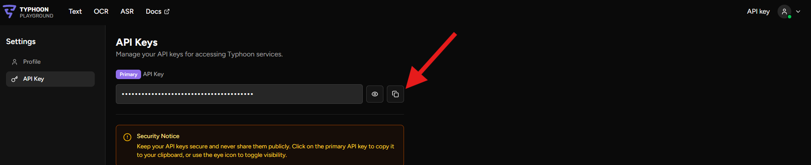
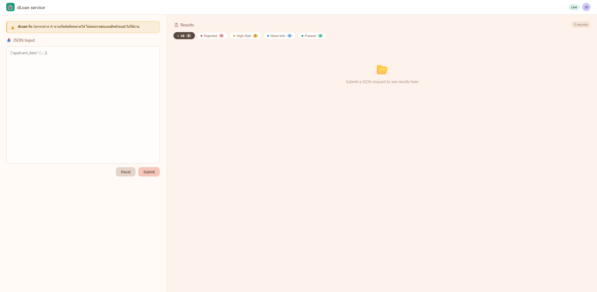
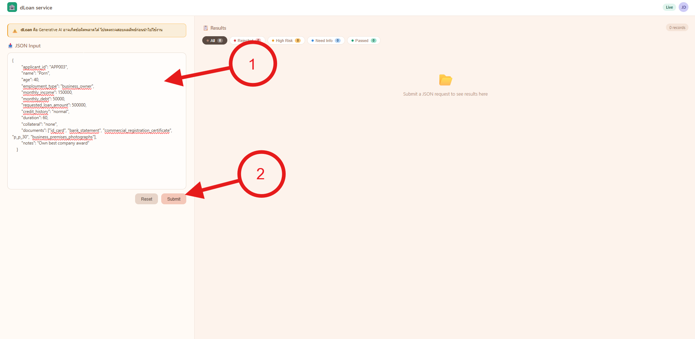
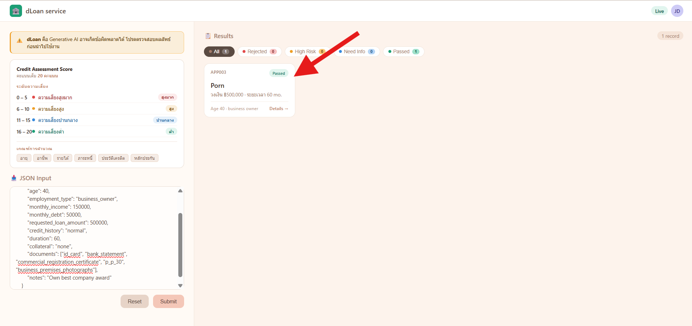
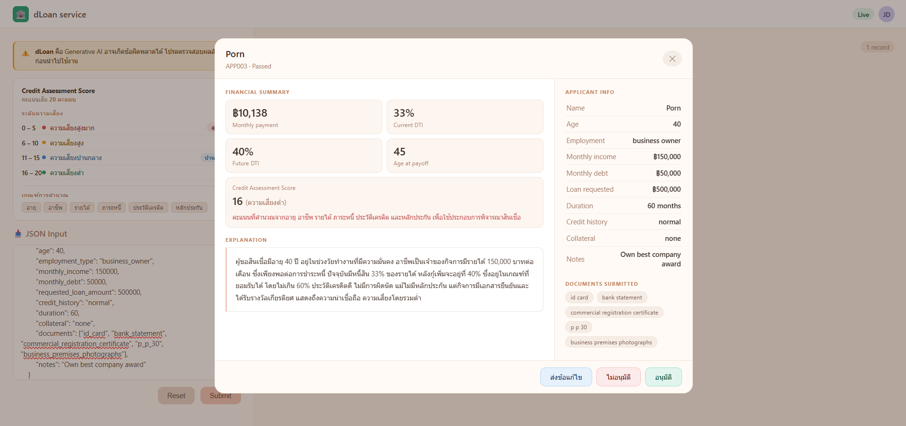

# ระบบ Generative AI ให้คำแนะนำและประเมินความเสี่ยงการอนุมัติสินเชื่อ 
### ภาพรวม
โปรเจ็คนี้คิอระบบ Generative AI ที่มีหน้าที่ช่วยตรวจสอบ และ แนะนำการอนุมัติสินเชื่อให้กับเจ้าหน้าที่อนุมัติสินเชื่อ เพื่อลดภาระงาน และ แสดงผลข้อมูลช่วยในการตัดสินใจได้อย่างถูกต้องและมีประสิทธิภาพ

### ฟีเจอร์
- Generative AI วิเคราะห์ และ ให้คำแนะนำในการอนุมัติสินเชื่อ
- ระบบตรวจสอบความครบถ้วนของข้อมูล
- ระบบคัดกรองใบขอสินเชื่อตามเกณฑ์ที่กำหนดไว้เบื้องต้น

### เทคโนโลยี
- Python 3.13
- FastAPI
- HTML / CSS / JavaScript
- Typhoon API (LLM)

---

## 📁 โครงสร้างไฟล์

```
loan-approval/
├── app/
│   ├── core
|   |     ├── __init__.py
|   |     ├── config.py
|   |     └── static.py
│   ├── endpoint
|   |     └── summary.py  <-- API backend 
│   ├── schemas
|   |     └── __init__.py 
│   ├── schemas
|   |     ├── data.py
|   |     └── model.py   <-- Prompt
│   └── main.py 
├── frontend/ 
│   └── index.html       <-- Frontend 
├── application.py
├── requirements.txt
└── test_case.py         <-- Sample applicant dataset 
```

---

## 🚀 วิธีติดตั้งและรัน

### 1. ดาวน์โหลดไฟล์ ZIP ของโปรเจกต์

1. เปิดหน้า GitHub Repository
2. คลิกปุ่ม **`<> Code`**

<p align="center">
  
</p>

3. คลิก **Download ZIP**

<p align="center">
  
</p>

4. เลือกตำแหน่งที่ต้องการจัดเก็บไฟล์
5. แตกไฟล์ ZIP ก่อนดำเนินการในขั้นตอนถัดไป

---
### 2. ติดตั้ง Python (ในกรณีที่ยังไม่เคยติดตั้ง Python มาก่อน)

โดยสามารถติดตั้ง Python เวอร์ชั่น 3.13.14 ได้บนเว็บไซต์
```bash
https://www.python.org/downloads/windows/
```

---
### 3. ติดตั้ง Package Python

1. เปิด Terminal ด้วยคีย์ลัด **`Win + R`**
2. พิมพ์ cmd แล้วกด Enter
3. ใช้คำสั่ง cd ไปยังโฟลเดอร์ที่แตกไฟล์มาก่อนหน้า
```bash
cd /path/to/folder
```
4. จากนั้นใส่คำสั่ง (เมื่อเสร็จขั้นตอนนี้อย่าพึ่งปิด Terminal)
```bash
pip install -r requirements.txt
```

---
### 4. เริ่มต้นใช้งาน

1. เปิดไฟล์ที่ชื่อว่า .env.example ขึ้น
2. จะพบ
```
TYPHOON_API_KEY = replace with you typhoon api key
```
3. ให้ทำการเปลี่ยนเป็น API key ของคุณโดยสามารถรับได้จากเว็บไซต์
```
https://playground.opentyphoon.ai/auth/sign-in
```
4. ให้ล็อคอินตามขั้นตอนของเว็บไซต์
5. เมื่อล็อคอินสำเร็จแล้วที่มุมขวาบนจะพบปุ่ม "API key"
<p align="center">
  
</p>

6. ให้ copy API key ที่ได้รับมาใส่ในไฟล์ .env.example
<p align="center">
  
</p>

7. จากนั้นให้ทำการเปลี่ยนชื่อไฟล์ .env.example เป็น .env
8. เมื่อขั้นตอนนี้เสร็จสิ้นให้กลับไปยัง Terminal แล้วพิมพ์คำสั่ง
```bash
python application.py
```
9. จากนั้นให้เปิด Browser แล้วใส่ URL นี้เป็นอันเสร็จสิ้นพร้อมใช้งาน
```
http://localhost:8000/
```

---
### 5. การใช้งานเว็บไซต์

หลังจากเข้ามายังเว็บไซต์ผ่าน บราวเซอร์จะพบหน้าเว็บไซต์
<p align="center">
  
</p>

1. โดยในการเริ่มใช้งานให้นำข้อมูลรูปแบบ JSON ที่เตรียมไว้กรอกเข้าไปยังฟอร์มด้านซ้ายมือ จากนั้นกดปุ่ม **`submit`**
<p align="center">
  
</p>

2. เมื่อกดปุ่ม submit ให้รอซักครู่เพื่อให้ระบบประมวลผล เมื่อประมวลผลเสร็จสิ้นจะขึ้นผลลัพธ์ทางด้านขวามือโดยสามารถกดเข้าไปเพื่อดูข้อมูลเพิ่มเติมได้
<p align="center">
  
</p>
<p align="center">
  
</p>

เป็นอันเสร็จสิ้นกระบวนการ

---
### หมายเหตุ
- เว็บไซต์นี้เป็นเพียงกระบวนการจำลอง เพื่อทดสอบระบบ Generative AI ในการวิเคราะห์และประเมินความเสี่ยงเท่านั้น
- ในการอนุมัติ ปฎิเสธ และ ยื่นขอแก้ไขเป้นเพียงการจำลองความสามารถเท่านั้นไม่สามารถยืนยันกระบวนการนั้นได้

---

## 📊 ผลลัพธ์การประเมิน 4 ประเภท

| สถานะ | ความหมาย | สี |
|-------|---------|-----|
| ✅ Proceed | ผ่านเกณฑ์ | เขียว |
| 📋 Need More Info | ข้อมูล/เอกสารไม่ครบ | น้ำเงิน |
| 🚫 Reject / Not Eligible | ไม่ผ่านเกณฑ์ | แดง |
| ⚠️ High Risk Review | ผ่านแต่เสี่ยงสูง | ส้ม |

---

# Disclaimer
This project is developed solely for demonstration and evaluation purposes as part of the dLoan Credit Operation Assignment.

The AI-generated recommendations are intended to assist credit officers and must not be used as the sole basis for approving or rejecting loan applications. Final lending decisions should always be made by authorized personnel following organizational policies and regulatory requirements.